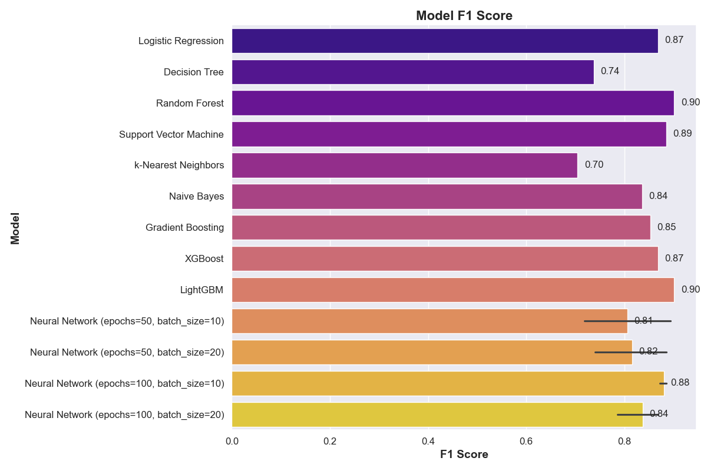

# Data science Machine Learning initial training

This project trains and evaluates multiple machine learning models on any classification data after preprocessing.
The used example dataset is the heart disease dataset from the UCI Machine Learning Repository. The goal is to get initial results for predicting heart disease based on various features. the discription of the dataset can be found here: https://archive.ics.uci.edu/dataset/45/heart+disease

## Overview

The code performs the following steps since it uses the heart disease dataset as an example:
1. Fetches the heart disease dataset from the UCI Machine Learning Repository.
2. Preprocesses the data by filling missing values and converting the target variable to binary.
3. Trains and evaluates multiple models using the `ModelTrainer` class.
4. Exports the results for each model in one CSV file, including the best parameters, accuracy, precision, recall, F1 score, and confusion matrix.


## Models
The models used in this code are:

1. **Logistic Regression**: This model uses the LogisticRegression class from scikit-learn. It is trained with different values of the regularization parameter C.

2. **Decision Tree**: This model uses the DecisionTreeClassifier class from scikit-learn. It is trained with different values of the maximum depth parameter.

3. **Random Forest**: This model uses the RandomForestClassifier class from scikit-learn. It is trained with different values of the number of estimators parameter.

4. **Support Vector Machine**: This model uses the SVC class from scikit-learn. It is trained with different values of the regularization parameter C and the kernel parameter.

5. **k-Nearest Neighbors**: This model uses the KNeighborsClassifier class from scikit-learn. It is trained with different values of the number of neighbors parameter.

6. **Naive Bayes**: This model uses the GaussianNB class from scikit-learn. It does not have any hyperparameters.

7. **Gradient Boosting**: This model uses the GradientBoostingClassifier class from scikit-learn. It is trained with different values of the number of estimators parameter.

8. **XGBoost**: This model uses the XGBClassifier class from the XGBoost library. It is trained with different values of the number of estimators parameter.

9. **LightGBM**: This model uses the LGBMClassifier class from the LightGBM library. It is trained with different values of the number of estimators parameter.

Additionally, there is a **neural network model** implemented using Keras. It consists of two dense layers with ReLU activation and a sigmoid output layer. The model is trained using the Adam optimizer and binary cross-entropy loss.
## Prerequisites

Make sure to have the necessary modules and packages installed before running the code. You can install the required packages using:

```bash
pip install -r requirements.txt
```


## Data
The data used in this code is the heart disease dataset from the UCI Machine Learning Repository. It contains 303 samples with 14 features each. The goal is to predict the presence of heart disease based on the features.


## Results
The results for each model include:

1. Best Parameters for each model
2. Accuracy
3. Precision
4. Recall
5. F1 Score
6. Confusion Matrix

Also, each result metric will be saved in a figure under the metric name, for example, here is the F1 score for the result:



And the following is the confusion matrix for one of the chosen model, all models confusion matrices will be plotted:


## License
This project is licensed under the MIT License.